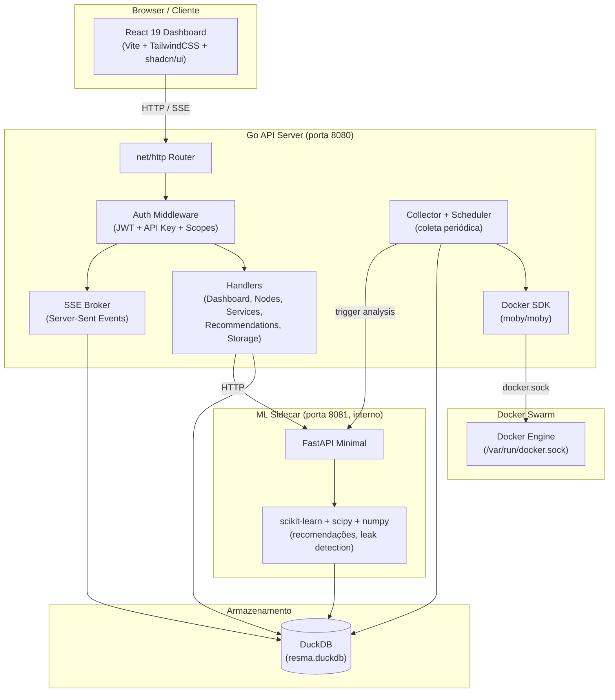

# RESMA — RESource MAnager for Docker Swarm

[](https://github.com/resma/resma/actions/workflows/ci.yml)
[](https://opensource.org/licenses/MIT)


> Gerenciador de recursos para Docker Swarm com coleta de métricas em tempo real,
> análise estatística, Machine Learning para recomendações de limites e detecção
> de memory leaks.

O RESMA monitora containers e services em clusters Docker Swarm, coletando
métricas de CPU e memória em intervalos configuráveis. Um sidecar de Machine
Learning analisa o histórico para recomendar limites de recursos (`cpu_limit`,
`mem_limit`), detectar memory leaks e rastrear eventos de OOM (Out-Of-Memory).
Tudo isso com um dashboard interativo, API REST e streaming em tempo real via SSE.

---

## Features

- **Métricas em tempo real** — coleta de CPU/memória de containers e services a cada 1s (configurável)
- **Multi-node Agent** — coleta de stats em todos os nodes do Swarm via agents leves (modo global, 1 por node)
- **Task monitoring** — lifecycle de tasks do Swarm em tempo real (restarts, falhas, distribuição por node)
- **Recomendações ML** — análise estatística com scikit-learn para sugerir `cpu_limit` e `mem_limit` ideais
- **Detecção de memory leaks** — regressão linear com coeficiente R² para identificar crescimento anômalo de memória
- **OOM tracking** — rastreamento de eventos de Out-Of-Memory via Docker event stream (multi-node)
- **Dashboard interativo** — visualizações em tempo real com React 19, Vite e TailwindCSS
- **API REST** — endpoints públicos (`/api/v1/*`) com API key + scopes e internos (`/api/*`) com JWT
- **SSE (Server-Sent Events)** — streaming de métricas, eventos, tasks e agents em tempo real via `/api/sse/*`

---

## Quick Start

### Docker Swarm (produção)

```bash
# Inicialize o Swarm (se ainda não estiver)
docker swarm init

# Instale o RESMA via script
curl -fsSL https://raw.githubusercontent.com/resma/resma/main/install.sh | bash
```

O script cria os secrets do Docker, faz deploy do stack e imprime as credenciais
do usuário owner (criado via onboarding). Para opções personalizadas:

```bash
curl -fsSL https://raw.githubusercontent.com/resma/resma/main/install.sh | bash -s -- --port 8080 --domain resma.example.com
```

### Docker Compose (produção local)

```bash
# Build e deploy via Docker Swarm (obrigatório para produção)
.\scripts\deploy-swarm.ps1
```

Acesse o dashboard em `http://localhost:8080`.

### Desenvolvimento

```bash
# Suba API Go + ML sidecar + frontend + 5 agents (multi-node, default)
docker compose up -d

# Ou dev standalone (1 agent apenas, sem workers)
docker compose -f docker-compose.standalone.yml up -d

# Frontend com hot reload (proxy /api → localhost:8080)
cd frontend
pnpm install
pnpm dev
```

Acesse:
- Dashboard (Vite dev): `http://localhost:5173`
- API Go: `http://localhost:8080`
- ML sidecar: `http://localhost:8081`

### Credenciais de Desenvolvimento

| Usuário | Senha      | Role  | Descrição                        |
|---------|------------|-------|----------------------------------|
| `owner` | `owner123` | owner | Criado via onboarding (primeiro) |
| `admin` | `admin123` | admin | Administrador (gestão completa)  |
| `user`  | `user123`  | user  | Usuário read-only (sem Config)   |

> O onboarding cria o `owner`. Os demais são criados via UI em
> Configurações → Usuários ou via API (`POST /api/users`).

---

## Arquitetura



---

## Stack

| Camada        | Tecnologia                                                              |
|---------------|-------------------------------------------------------------------------|
| API           | Go 1.26 + `net/http` + DuckDB (`go-duckdb`) + Docker SDK (`moby/moby`) |
| ML sidecar    | Python 3.12 + scikit-learn + scipy + numpy (FastAPI minimal)           |
| Frontend      | React 19 + Vite 6 + TailwindCSS 4 + shadcn/ui                          |
| Auth          | JWT (`golang-jwt`) + bcrypt + API key com scopes                        |
| Real-time     | SSE (Server-Sent Events) via `net/http` + `http.Flusher`               |
| Armazenamento | DuckDB (embedded, columnar OLAP)                                       |
| Deploy        | Docker (docker-compose.yml com profiles `dev`/`prod`, Docker Swarm)    |

---

## Documentação

| Documento | Descrição |
|-----------|-----------|
| [docs/multi-node.md](docs/multi-node.md) | Arquitetura e configuração do RESMA Agent para coleta multi-node |
| [docs/task-monitoring.md](docs/task-monitoring.md) | Monitoramento de tasks do Swarm (lifecycle, restarts, service health) |
| [docs/benchmarks.md](docs/benchmarks.md) | Benchmarks de performance e escalabilidade |
| [docs/TECH_SPEC.md](docs/TECH_SPEC.md) | Spec técnica completa do projeto |
| [docs/specs/oss/](docs/specs/oss/) | Specs detalhadas por fase (0, 0b, 1-7) |

---

## Configuração

Todas as variáveis de ambiente estão documentadas em [`.env.example`](.env.example).
Copie para `.env` e ajuste conforme necessário:

```bash
cp .env.example .env
```

Principais variáveis:

| Variável                      | Default              | Descrição                          |
|-------------------------------|----------------------|------------------------------------|
| `RESMA_ENV`                   | `dev`                | Ambiente (`dev` ou `production`)   |
| `RESMA_HTTP_ADDR`             | `:8080`              | Endereço do servidor HTTP          |
| `RESMA_DB_PATH`               | `/data/resma.duckdb` | Caminho do banco DuckDB            |
| `RESMA_JWT_SECRET`            | `dev-secret-change-me` | Secret do JWT (obrigatório em prod) |
| `RESMA_COLLECT_INTERVAL`      | `1`                  | Intervalo de coleta (segundos)     |
| `RESMA_RETENTION_DAYS`        | `30`                 | Retenção de dados (dias)           |
| `RESMA_ML_ENABLED`            | `true`               | Habilita ML sidecar                |
| `RESMA_LEAK_R2_THRESHOLD`     | `0.7`                | Threshold R² para detecção de leak |

---

## Documentação

A documentação completa (guia de instalação, referência de API, arquitetura,
tutoriais) está em [`docs-site/`](docs-site/) — um site Docusaurus.

Para rodar localmente:

```bash
cd docs-site
pnpm install
pnpm start
```

---

## Contribuindo

Contribuições são bem-vindas! Veja [**CONTRIBUTING.md**](CONTRIBUTING.md) para
o guia completo de configuração de desenvolvimento, padrões de código e fluxo
de PRs.

Por favor, leia também nosso [**Código de Conduta**](CODE_OF_CONDUCT.md) para
entender os padrões de comportamento esperados em nossa comunidade.

---

## Licença

Este projeto está licenciado sob a **Licença MIT** — veja o arquivo
[`LICENSE`](LICENSE) para detalhes.

---

## Agradecimentos

- [Docker](https://www.docker.com/) — pela excelente SDK em Go e Docker Swarm
- [DuckDB](https://duckdb.org/) — pelo banco analítico embedded que torna tudo rápido
- [scikit-learn](https://scikit-learn.org/) — pelas ferramentas de ML que alimentam as recomendações
- [React](https://react.dev/) + [Vite](https://vitejs.dev/) — pela experiência de desenvolvimento do frontend
- [shadcn/ui](https://ui.shadcn.com/) — pelos componentes de UI acessíveis e elegantes
- [Contributor Covenant](https://www.contributorcovenant.org/) — pelo Código de Conduta
- A todos os [contribuidores](https://github.com/resma/resma/graphs/contributors) que dedicam seu tempo ao projeto
